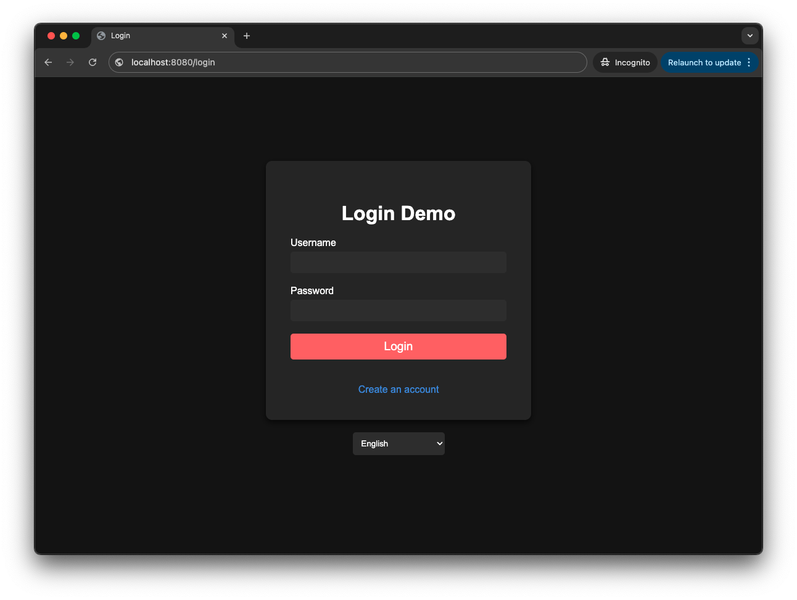
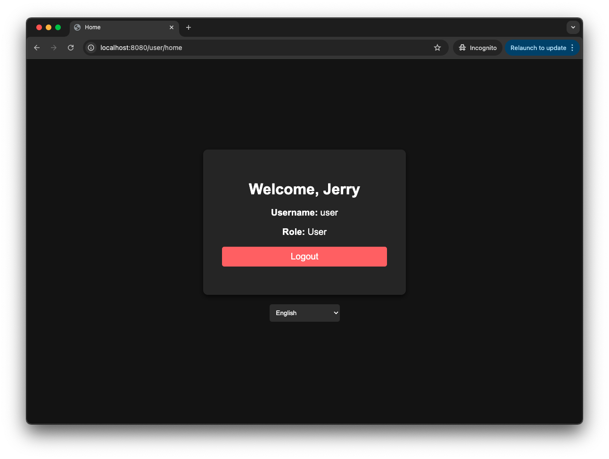
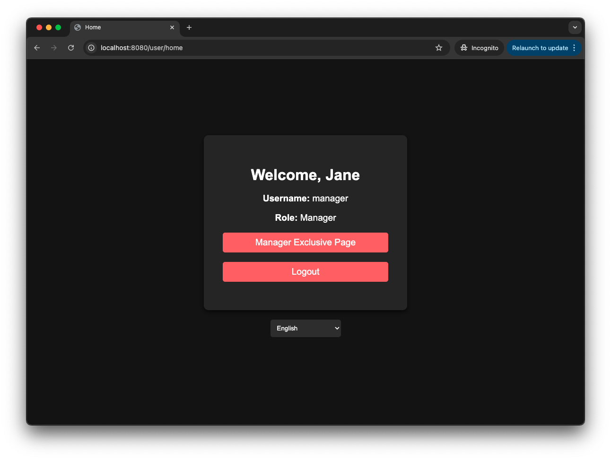
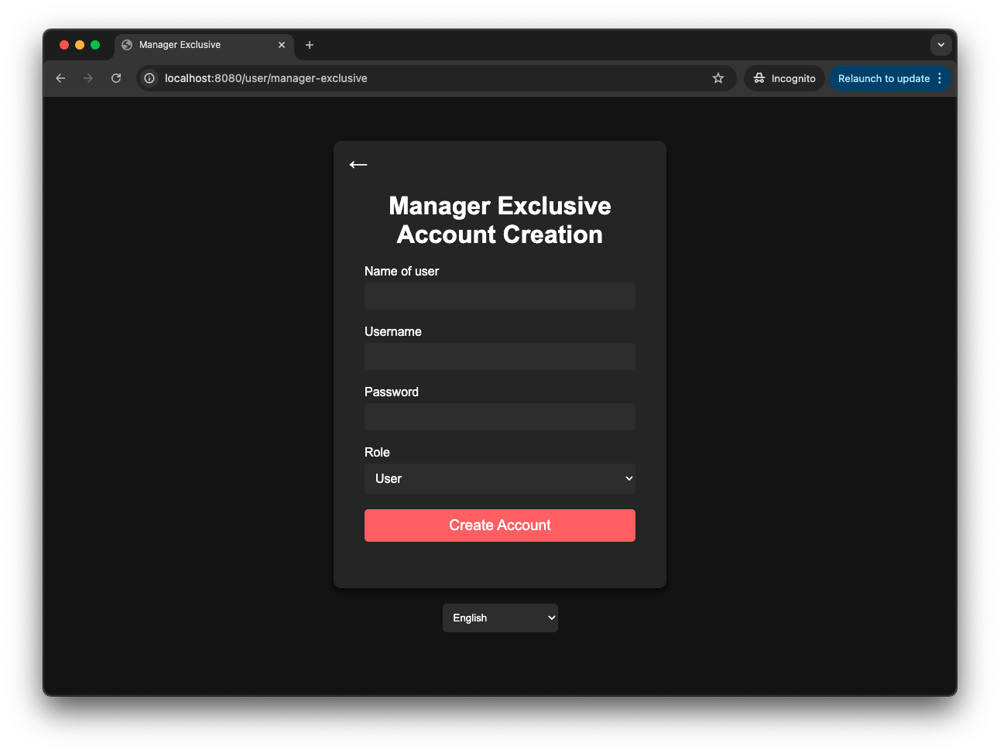
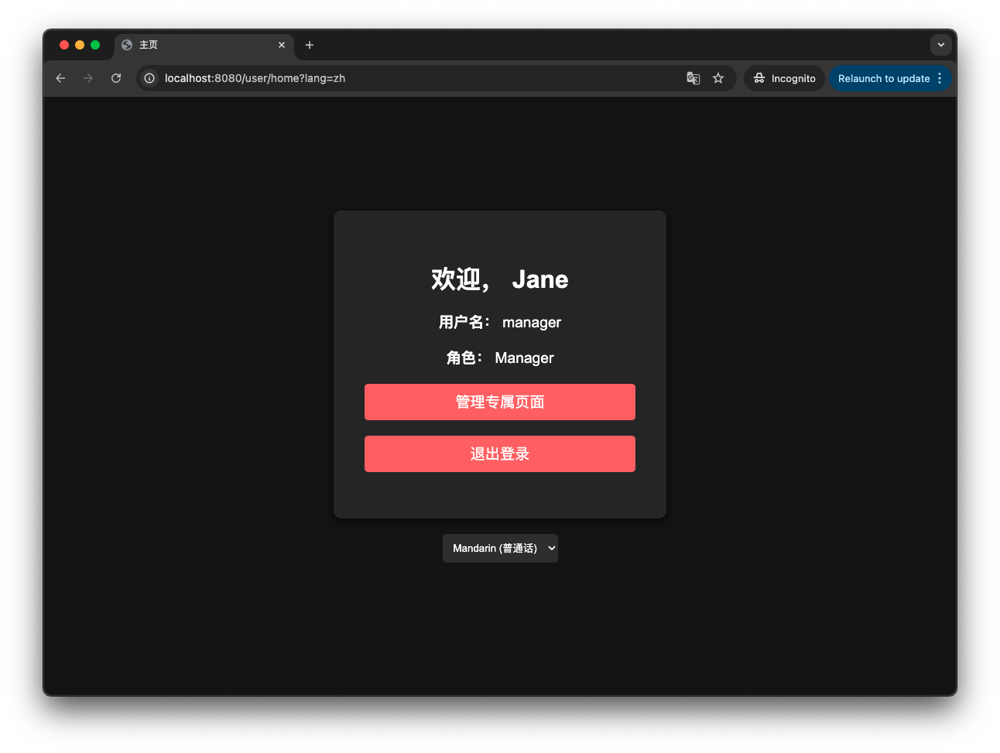

## This application allows users to log in with their credentials and provides role-based access control.

>> ### Features
>> - User login/logout functionality
>> - Role-based access control (User, Manager)
>> - Multi-language support (English, Malay, Mandarin, Tamil)
>> - Secure password hashing
>
>> ### Frameworks and Tools Used
>> - **Build Tool**: Maven
>> - **Web Framework**: Spring Boot
>> - **Security Framework**: Spring Security
>> - **Template Engine**: Thymeleaf
>> - **Relational Databases**:
>>     - MySQL Database
>>     - H2 Database (for demo contingency)
>> - **Markup and Styling**: HTML, CSS
>
>> ### MySQL Database Setup
>> 1. Access MySQL via the workbench / command line interface
>> 2. Create a schema: `CREATE DATABASE DXC_DEMO;`
> 
>> ### Installation Instructions
>> 1. Clone the repository: `git clone <repository-url>`
>> 2. Navigate to the project directory: `cd <project-directory>`
>> 3. Build the project with Maven: `mvn clean compile install`
>> 4. If you have set up MySQL database:
>>    - `mvn spring-boot:run -Dspring-boot.run.profiles=uat`
>> 5. Alternatively:
>>    - `mvn spring-boot:run -Dspring-boot.run.profiles=dev`
>
>> ### Usage
>> - Open your browser and go to `http://localhost:8080/login`
>> - Default accounts are created on start-up with the password **123**
>>   - Usernames
>>      - _user_
>>      - _manager_
>> - Enter either credentials to log in.

---

  <figure>
      <figcaption>Figure 1: Login page</figcaption>
      
  </figure>

---

  <figure>
      <figcaption>Figure 2: User home page</figcaption>
      
  </figure>

---

  <figure>
      <figcaption>Figure 3: Manager home page</figcaption>
      
  </figure>

---

  <figure>
      <figcaption>Figure 4: Manager exclusive page</figcaption>
      
  </figure>

---

  <figure>
      <figcaption>Figure 5: Language selection feature</figcaption>
      
  </figure>

